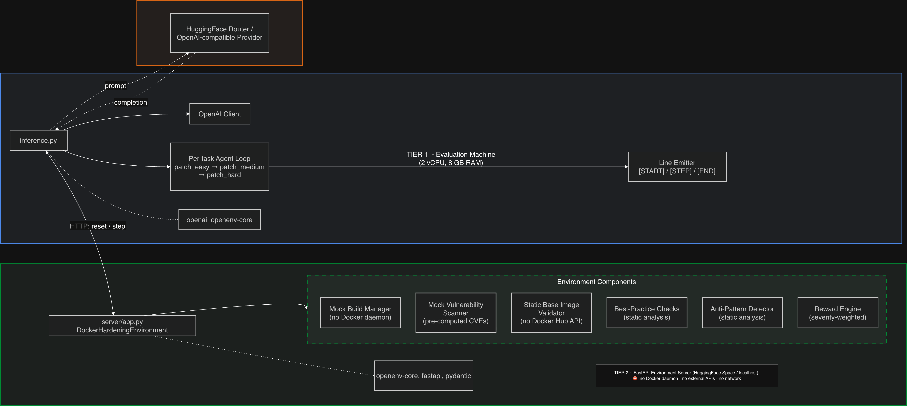

# SCA-Gym

---

## Table of Contents

1. [Executive Summary](#1-executive-summary)
2. [The Problem We're Solving](#2-the-problem-were-solving)
3. [High-Level Architecture](#3-high-level-architecture)
4. [Repository Layout](#4-repository-layout)
5. [Environment Design (MDP)](#5-environment-design-mdp)
   - 5.1 [State](#51-state)
   - 5.2 [Action](#52-action)
   - 5.3 [Observation](#53-observation)
   - 5.4 [Reward](#54-reward)
6. [The Task Suite](#6-the-task-suite)
7. [The Evaluation Loop](#7-the-evaluation-loop)
   - 7.1 [What `reset()` does](#71-what-reset-does)
   - 7.2 [What `step()` does](#72-what-step-does)
   - 7.3 [Termination conditions](#73-termination-conditions)
8. [The Scoring Model](#8-the-scoring-model)
9. [Simulated Components (Why No Real Docker / APIs)](#9-simulated-components-why-no-real-docker--apis)
   - 9.1 [Mock vulnerability scanner](#91-mock-vulnerability-scanner)
   - 9.2 [Static base image tag validator](#92-static-base-image-tag-validator)
   - 9.3 [Mock build manager](#93-mock-build-manager)
   - 9.4 [Best-practice and anti-pattern checks](#94-best-practice-and-anti-pattern-checks)
   - 9.5 [Regression and conflict detection](#95-regression-and-conflict-detection)
10. [Eval Mode vs Train Mode](#10-eval-mode-vs-train-mode)
11. [The Inference Agent](#11-the-inference-agent)
12. [RL Training (GRPO)](#12-rl-training-grpo)
13. [Running Locally](#13-running-locally)
14. [HuggingFace Space Deployment](#14-huggingface-space-deployment)
15. [Environment Variables](#15-environment-variables)
16. [Output Format](#16-output-format)
17. [Design Decisions & Trade-offs](#17-design-decisions--trade-offs)
18. [Limitations & Future Work](#18-limitations--future-work)

---

## 1. Executive Summary

**SCA-Gym** is a reinforcement learning environment that teaches LLM agents to fix security vulnerabilities in Docker images. The agent receives a broken, vulnerable Dockerfile plus a security scan report and its job is to output a patched Dockerfile that fixes the CVEs, adopts security best practices, and eliminates anti-patterns — all within a small step budget.

The environment implements the [OpenEnv](https://github.com/meta-llama/openenv) interface and is submitted to the **Meta OpenEnv RL Hackathon**. It is designed to:

- **Run anywhere, cheaply.** No Docker daemon. No external APIs. No network calls during evaluation. All scoring is static analysis and pre-computed data, which means it fits inside a 2 vCPU / 8 GB RAM eval container and a free HuggingFace Space.
- **Be a real RL task, not a toy.** The reward is multi-objective (CVE reduction, best practices, anti-pattern removal), severity-weighted, and shaped densely per step so that GRPO has a strong training signal.
- **Serve two workloads from the same codebase.** The same environment powers (a) hackathon evaluation through an OpenAI-compatible LLM API, and (b) local GRPO training of an open-source code model on your own GPU.

---

## 2. The Problem We're Solving

Software Composition Analysis (SCA) tools like Trivy, Grype, and Snyk are good at **finding** vulnerabilities in container images. They are not good at **fixing** them. Remediation is still a manual, error-prone job that involves juggling:

- Transitive dependencies and lock files
- Breaking changes on major version upgrades
- No-fix-available CVEs and disputed findings
- False positives (e.g. log4j flagged on a Python image)
- Base image trade-offs (Alpine vs Debian vs Distroless)
- Security hygiene that has nothing to do with CVEs (non-root user, secrets in ENV, healthchecks)
- Supply-chain risks (pipe-to-shell installs, `ADD` from URL, hardcoded credentials)

We want to train — and evaluate — an LLM that can reason about all of these at once and produce a single patched Dockerfile that is both **more secure** and **still works**. That is what SCA-Gym tests.

---

## 3. High-Level Architecture



The project is split into two cleanly separated tiers so that the heavy work happens on the environment server and the evaluation machine stays lightweight.

- The **inference script** (`inference.py`) is the hackathon entry point. It knows how to prompt an LLM, parse the response, and drive the environment through a short loop for each task.
- The **environment server** is a FastAPI app built with OpenEnv's `create_app()`. It runs the real scoring logic and never needs Docker, a scanner binary, or the internet.
- The **same `DockerHardeningEnvironment` class** can also be imported directly in-process (the inference script does this when no `ENV_BASE_URL` is set), which is useful for offline debugging, CI, and local GRPO training.

---

## 4. Repository Layout

```
docker_hardening/
├── Dockerfile                           # HF Space container (root-level build context)
├── pyproject.toml                       # Package + optional train deps
├── uv.lock                             # Locked dependencies
├── openenv.yaml                         # Environment descriptor (7 tasks)
├── requirements.txt                     # Eval-machine deps
├── inference.py                         # Hackathon entry point
├── validation.sh                        # Submission validator script
├── README.md
│
├── models.py                            # Pydantic v2 Action/Observation/State
├── client.py                            # Async OpenEnv client (HTTP)
├── curriculum.py                        # 7-tier difficulty curriculum (for RL)
│
├── server/
│   ├── app.py                           # FastAPI app (OpenEnv create_app)
│   ├── docker_hardening_environment.py  # Core environment logic
│   └── requirements.txt                # Server deps
│
├── tools/
│   ├── scanner.py                       # Mock scanner + bp + ap + tag validator
│   ├── docker_manager.py               # Mock (and real) Docker build manager
│   ├── reward_engine.py                 # Legacy shaped-reward helpers
│   └── patch_agent.py                   # Optional rule-based / API patch agent
│
├── examples/
│   ├── train_rl.py                      # GRPO training with TRL
│   ├── eval_rl.py                       # Trained model vs baseline
│   ├── train_grpo.py                    # Offline curriculum demo (no GPU)
│   └── train_ex.py                      # Minimal client example
│
└── tests/
    ├── test_environment.py
    └── test_patch_provider_selection.py
```

---

## 5. Environment Design (MDP)

We formulate Docker hardening as a Markov Decision Process. The formulation is deliberately simple so GRPO can learn from it, but it captures enough structure that the agent has to reason about security, not just memorize templates.

### 5.1 State

Internally the environment tracks, per episode:

- The original (vulnerable) Dockerfile and the current patched version
- The current `VulnReport` and the initial `VulnReport`
- The initial and current best-practice satisfaction dicts
- The initial and current anti-pattern warning lists
- Step count, cycle count, cumulative reward, consecutive failure count
- Task name, difficulty level, max steps, base image tag
- An isolated temp directory managed by `DockerBuildManager`

See `DockerHardeningEnvironment.__init__` in `server/docker_hardening_environment.py`.

### 5.2 Action

The agent submits one object:

```python
class DockerHardeningAction(Action):
    patched_dockerfile: str   # the complete patched Dockerfile text
```

We chose **complete Dockerfiles** instead of diffs because:

- LLMs are much better at generating a complete file than a valid unified diff.
- Validation is simpler on a complete file.
- The environment can compute its own diff internally for logging.

### 5.3 Observation

After each step the environment returns a `DockerHardeningObservation` with:

| Field                    | Description                                                  |
| ------------------------ | ------------------------------------------------------------ |
| `current_dockerfile`     | Full text of the Dockerfile currently in effect              |
| `vulnerability_summary`  | Human-readable scan report (formatted for the LLM)           |
| `task_name`              | `patch_easy`, `patch_medium`, `patch_hard`, etc.             |
| `initial_vuln_count`     | Number of CVEs at episode start                              |
| `current_vuln_count`     | Number of CVEs remaining                                     |
| `step_number`            | 1-based step counter                                         |
| `max_steps`              | Budget for this task                                         |
| `score`                  | Normalized improvement score in `[0.0, 1.0]`                 |
| `security_score`         | A 0–100 "audit style" score shown to the user                |
| `best_practices`         | List of `[PASS]`/`[FAIL]` lines                              |
| `antipattern_warnings`   | List of detected anti-patterns                               |
| `step_summary`           | Human-readable summary of what happened this step            |
| `last_action_error`      | Error message if the action was rejected                     |
| `termination_reason`     | Why the episode ended (if `done=True`)                       |

The `vulnerability_summary` is the most important part — it's the human-readable string the LLM actually reads as its security briefing. It includes:

- Each CVE sorted by severity with fix hints
- A copy-paste `pip install` line for any Python CVEs (eval mode)
- The best-practices checklist
- The anti-pattern warnings

### 5.4 Reward

The reward is **dense and shaped** so GRPO gets a strong signal on every step. It has two levels:

- **Step reward** — a small number computed each step from the change in score.
- **Episode score** — the `[0, 1]` number that measures overall security improvement from the initial state.

Full details are in [§8 The Scoring Model](#8-the-scoring-model).

---

## 6. The Task Suite

The environment defines **seven tasks** in `server/docker_hardening_environment.py` (and matching entries in `openenv.yaml`). Tasks 1–3 are the **hackathon scoring tasks**; 4–7 are **training-only tasks** used for the RL curriculum.

| # | Task                | Difficulty | Base image          | Vulns | Max steps | What it tests                                                |
|---|---------------------|------------|---------------------|-------|-----------|--------------------------------------------------------------|
| 1 | `patch_easy`        | 1          | `python:3.11-slim`  | 4     | 4         | Basic base-image upgrade, remove pipe-to-shell               |
| 2 | `patch_medium`      | 2          | `python:3.9-slim`   | 9     | 4         | Pip upgrades, remove secrets, `ADD`→`COPY`, HEALTHCHECK       |
| 3 | `patch_hard`        | 3          | `python:3.6-slim`   | 14    | 3         | CRITICAL CVEs, log4j false positive, supply-chain, DB ports  |
| 4 | `patch_multistage`  | 4          | `python:3.9-slim`   | 9     | 5         | Multi-stage build hygiene, builder vs runtime                |
| 5 | `patch_conflict`    | 5          | `python:3.9-slim`   | 11    | 5         | Conflicting deps, no-fix CVEs, Alpine + C-extension trap     |
| 6 | `patch_subtle`      | 6          | `python:3.9-slim`   | 9     | 4         | Base64/URL-embedded secrets, cache-busting COPY order        |
| 7 | `patch_adversarial` | 7          | `python:3.9-slim`   | 13    | 3         | Decoy vulns, needed ports, mid-build `USER root`             |

Each task carries a deliberately-broken Dockerfile inline in `TASKS`. Every vulnerable pattern in the source has a matching detection rule in the scanner / best-practice / anti-pattern modules, so the scoring is internally consistent.

---

## 7. The Evaluation Loop

### 7.1 What `reset()` does

1. Reads `SCA_GYM_TASK` from the environment (default: `patch_easy`).
2. Looks up the task definition (Dockerfile, difficulty, max steps, base image).
3. Creates a new episode id and a fresh `DockerBuildManager` in **mock mode** with an isolated temp directory.
4. Runs the initial `scan_mock()` to build the initial `VulnReport`.
5. Runs `check_best_practices()` and `detect_antipatterns()` on the starting Dockerfile.
6. Renders the human-readable `vulnerability_summary` with `_format_vuln_summary()`.
7. Returns the first observation with `score=0.0, done=False`.

### 7.2 What `step()` does

Every call to `step(action)` runs this pipeline:

1. **Validate syntax.** `_validate_dockerfile()` ensures the text is non-empty and contains a `FROM` line. It also calls `validate_base_image_tag()` to check the base image against the static whitelist (`VALID_BASE_IMAGES`). Failures return a `-BUILD_FAIL_COST` penalty, increment the consecutive-failure counter, and leave the state untouched.
2. **Strip markdown fences.** Some LLMs wrap their answer in ```` ```dockerfile ```` blocks; we unwrap them defensively.
3. **No-op detection.** If the new Dockerfile is identical to the previous one, we charge `NOOP_PENALTY` and move on.
4. **Mock build.** `DockerBuildManager.apply_patch()` writes the new Dockerfile to the episode's temp dir and, in `use_mock=True`, accepts it as "built" without invoking Docker. It returns a synthetic tag like `rl-hardened/<episode>:cycle-<n>`.
5. **Mock scan.** `scan_mock(tag, difficulty, current_dockerfile=patched_df)` applies the Dockerfile-aware fix simulation (see §9.1) and returns a new `VulnReport` containing only the CVEs that are still unfixed — plus any regressions introduced by the patch.
6. **Best-practice / anti-pattern re-check.** The patched Dockerfile is re-analyzed, so improvements in hygiene immediately feed into the score.
7. **Compute step reward.** `_compute_improvement_score(initial, prev)` and `_compute_improvement_score(initial, current)` are computed, and the **delta** (minus a step cost and any regression penalty, plus any efficiency bonus) becomes the step reward.
8. **Compute episode score.** The same `_compute_improvement_score` call against the current state becomes the overall `[0, 1]` score in the observation.
9. **Check termination.** `_check_termination()` returns true when all vulns are fixed, the max-step budget is reached, or three consecutive failures have been recorded.
10. **Return the new observation** with reward, score, updated Dockerfile, new vuln summary, and all the best-practice/anti-pattern detail.

### 7.3 Termination conditions

From `_check_termination()`:

- `ALL_VULNS_FIXED` — scan report is empty → instant terminal reward path.
- `MAX_CYCLES_REACHED` — hit the per-task `max_steps` budget.
- `PATCH_FAILED_TOO_MANY_TIMES` — three consecutive invalid / no-op / build-failed submissions.

---

## 8. The Scoring Model

### 8.1 Episode score (shown in the observation as `score`)

The episode score is a weighted sum of three dimensions, each in `[0, 1]`:

```
score = w_vuln * vuln_improvement
      + w_bp   * bp_improvement
      + w_ap   * ap_improvement
```

- **Vulnerability reduction (50%)** — severity-weighted. Fixing a CRITICAL counts 4× a LOW. See `_weighted_vuln_score()`:

  ```
  CRITICAL = 4.0, HIGH = 3.0, MEDIUM = 2.0, LOW = 1.0
  NEGLIGIBLE = 0.5, UNKNOWN = 1.0
  ```

- **Best-practices improvement (30%)** — fraction of initially-failing checks that now pass. There are 10 checks (non-root USER, HEALTHCHECK, no secrets, apt cache cleanup, `pip --no-cache-dir`, `COPY` over `ADD`, modern base image, layer efficiency, COPY order, minimal packages).

- **Anti-pattern removal (20%)** — fraction of initial anti-patterns that are now absent. Detected patterns include secrets in ENV/ARG, `ADD` from URL, pipe-to-shell, `:latest` tag, exposed DB ports, embedded credentials in URLs, `get.docker.com` installs, `chmod 777`, cache-busting COPY order, and running as root.

**For hard tasks (difficulty ≥ 4)** the weights shift to `(vuln=0.40, bp=0.30, ap=0.30)` because these tasks have fewer easy CVE wins and more subtle hygiene issues.

### 8.2 Step reward

Per step:

```
step_reward = (curr_score - prev_score)     # delta improvement
            - STEP_COST                      # -0.02, encourages brevity
            - REGRESSION_COST * regressions  # -0.10 per new regression
            + efficiency_bonus               # +0.10 if solved in 1 step, +0.05 in 2
```

Efficiency bonuses are disabled for difficulty ≥ 5 so the agent doesn't rush the harder tasks.

| Constant          | Value | Purpose                                          |
| ----------------- | ----- | ------------------------------------------------ |
| `_STEP_COST`      | 0.02  | Incentivize efficiency                           |
| `_NOOP_PENALTY`   | 0.05  | Punish resubmitting the same Dockerfile          |
| `_BUILD_FAIL_COST`| 0.03  | Punish syntactically invalid submissions         |
| `_REGRESSION_COST`| 0.10  | Per regression introduced (new CVE / conflict)   |
| `_EFFICIENCY_BONUS` | `{1: 0.10, 2: 0.05}` | Fast-solve bonus                   |

### 8.3 Security audit score

`_compute_security_score()` separately produces a 0–100 value used for the `security_score` field of the observation. It's a cosmetic score for human readers and is not used for gradients.

---

## 9. Simulated Components (Why No Real Docker / APIs)

Hackathon evaluation runs inside a 2 vCPU / 8 GB RAM container. HuggingFace Spaces do not expose a Docker daemon. Scanning real images with Trivy costs seconds per scan and depends on the network. We therefore implement every I/O boundary as **deterministic, in-process simulation** without giving up correctness.

### 9.1 Mock vulnerability scanner

`tools/scanner.py::scan_mock()` is the heart of the environment.

1. It keeps **hand-curated CVE templates** per difficulty level (see `_MOCK_TEMPLATES`). Each entry is `(severity, package, installed_version, fixed_version)`, with real CVE descriptions in `_CVE_DESCRIPTIONS`.
2. When called with `current_dockerfile=...`, it runs `_simulate_dockerfile_fixes()` which applies these rules to decide which CVEs remain:
   - System package CVEs (`openssl`, `curl`, `libc6`, `libssl1.1`, `tzdata`, etc.) are fixed if the Dockerfile uses a **modern Python base image** (`python:3.12+`) **or** runs `apt-get upgrade`.
   - Pip package CVEs (`flask`, `jinja2`, `cryptography`, etc.) are fixed only if the Dockerfile contains an **explicit pip upgrade**: `pip install --upgrade <pkg>`, `pip install -U <pkg>`, `pip install <pkg>>=<version>`, or a `sed` pin in `requirements.txt` followed by `pip install -r`.
   - `log4j` is automatically recognized as a **false positive** on non-Java images (no `jdk`, `jre`, or `java` tokens in the Dockerfile).
   - CVEs with `fixed_version=None` are unfixable and stay in the report.
3. Regressions are added via `_detect_regressions()` (see §9.5).
4. The backends `scan_with_trivy()` and `scan_with_grype()` still exist in the same file for future real-scanner use; they're just not wired up in the hackathon flow.

### 9.2 Static base image tag validator

`validate_base_image_tag()` replaces the Docker Hub Registry API. We maintain a static dictionary `VALID_BASE_IMAGES` listing known-good tags for `python`, `node`, `alpine`, `ubuntu`, `debian`, `nginx`, `golang`, and distroless. When the agent proposes a `FROM`, we check the tag against this whitelist and reject unknown tags with an error message that lists valid suggestions. Unknown image **families** pass through unchecked so users can reference their own internal images if they want.

This catches the single biggest hallucination failure mode: LLMs inventing plausible-sounding tags like `python:3.12.1-slim-bookworm-security` that don't exist.

### 9.3 Mock build manager

`tools/docker_manager.py::DockerBuildManager` has two modes:

- **`use_mock=True`** (hackathon default) — writes the Dockerfile to an isolated temp directory, updates the internal tag, and returns success. No subprocess, no daemon, no network.
- **`use_mock=False`** — shells out to real `docker build` against the isolated build context (for local testing if you have Docker installed).

Each episode gets its own temp dir so multiple environment instances can run concurrently without stepping on each other. Minimal context files (`requirements.txt`, `app.py` stubs) are seeded so `COPY` instructions don't break a real build. `cleanup()` prunes the temp dir and any locally-built images.

### 9.4 Best-practice and anti-pattern checks

`check_best_practices()` and `detect_antipatterns()` in `tools/scanner.py` are pure static analysis over the Dockerfile text. They check:

**Best practices (10 checks)**

1. Non-root `USER` placed *after* the last `RUN`/`COPY`/`ADD`
2. Real `HEALTHCHECK` (not `CMD true` / `NONE` / `exit 0`)
3. No secrets in `ENV`/`ARG` (regex for `PASSWORD|SECRET|TOKEN|API_KEY|PRIVATE_KEY|CREDENTIALS`)
4. APT cache cleanup (`rm -rf /var/lib/apt/lists`)
5. `pip --no-cache-dir` on every `pip install` line
6. `COPY` used instead of `ADD`
7. Modern base image (`python:3.12+`)
8. Layer efficiency (≤ 2 consecutive `RUN` lines)
9. `COPY requirements.txt` before bulk `COPY . .` (cache efficiency)
10. `apt-get install --no-install-recommends`

**Anti-patterns**

- Secrets in ENV/ARG
- `ADD` from URL
- Pipe-to-shell (`curl | sh`, `wget | bash`)
- `:latest` tag
- Exposed database/cache ports (5432, 3306, 27017, 6379, 1433, 11211)
- Credentials embedded in URLs (`user:pass@host`)
- Base64-encoded secrets in ENV/ARG
- `get.docker.com` (Docker-in-Docker install)
- `chmod 777`
- `COPY . .` before `COPY requirements.txt` (cache invalidation)
- Running as root (no non-root `USER` after build steps)

### 9.5 Regression and conflict detection

`_detect_regressions()` flags new vulnerabilities the agent might introduce:

- **`REGRESSION-001`** — using `:latest` tag
- **`REGRESSION-003`** — switching to Alpine with a C-extension Python package (numpy/scipy/pandas/pillow/cryptography) — Alpine uses musl libc, so these will break.
- **`CONFLICT-001`** (difficulty ≥ 5) — upgrading `cryptography` to 42+ while still pinning `libssl1.1`.
- **`BUILD-FAIL-001`** (difficulty ≥ 4) — removing `gcc` but still `pip install`-ing packages that need compilation, outside a multi-stage build.

These are returned as synthetic CVE entries with prefixes (`REGRESSION-`, `CONFLICT-`, `BUILD-FAIL-`) so the reward engine can count them and apply the regression penalty.

---

## 10. Eval Mode vs Train Mode

The environment supports two modes, selected by the `SCA_GYM_MODE` environment variable.

| Aspect                  | `eval` (default)                                              | `train`                                                    |
| ----------------------- | ------------------------------------------------------------- | ---------------------------------------------------------- |
| Target                  | Hackathon scoring with an API LLM                             | Local GRPO training of a small code model                  |
| Vulnerability summary   | Includes copy-paste `pip install --upgrade ...` hint lines    | Withholds exact commands (agent must reason)               |
| Fix strings             | `-> fix: 7.86.0`                                              | `(system package — upgrade base or apt-get upgrade)`       |
| Observation noise       | None                                                          | For difficulty ≥ 4, extra vague hints to discourage memorization |

Both modes use the same scoring logic. Train mode only changes what the agent *sees*.

---

## 11. The Inference Agent

`inference.py` at the repo root is the hackathon entry point. It runs on the eval machine and does the following:

1. **Bootstrap.** Reads `HF_TOKEN` (mandatory), `API_BASE_URL` (default: HuggingFace router), `MODEL_NAME` (default: `Qwen/Qwen2.5-72B-Instruct`). Instantiates an `openai.OpenAI` client pointed at the API base URL.
2. **Per-task loop.** For each of `patch_easy`, `patch_medium`, `patch_hard`:
   - Sets `SCA_GYM_TASK` and `SCA_GYM_MODE=eval`.
   - Connects to the environment: if `IMAGE_NAME` is set, uses `from_docker_image()`; if `ENV_BASE_URL` is set, uses the HTTP client; otherwise falls back to `_InlineEnv`, which imports the environment class directly and runs it in-process.
   - Calls `reset()`, prints a `[START]` line, then loops up to `MAX_STEPS` times.
3. **Prompt construction.** `_build_user_prompt()` assembles:
   - The current Dockerfile in a fenced block
   - The vulnerability report (the `vulnerability_summary` field)
   - If the previous step's reward was non-positive, an `IMPORTANT:` nudge
   - The last 3 steps of history (vulns remaining, reward, errors, still-failing checks)
   - A final "Output the complete patched Dockerfile now." instruction
4. **Temperature ramp.** Temperature starts at 0.3 on step 1 and rises by 0.15 per subsequent step, capped at 0.7. This gives the model room to explore different strategies if its earlier attempts weren't improving the score.
5. **System prompt.** A tight ruleset telling the model: output ONLY the Dockerfile (no fences, no explanation), use pinned versions, upgrade the base image, add a non-root `USER` after build steps, add a real `HEALTHCHECK`, strip secrets, use `COPY` instead of `ADD`, use `pip --no-cache-dir`, and remove pipe-to-shell / ADD-from-URL patterns.
6. **Graceful failures.** If the model call raises, the agent returns the previous Dockerfile unchanged (which triggers a no-op penalty but keeps the episode alive). The `[END]` line is always emitted in a `finally` block.
7. **Line logging.** `log_start()`, `log_step()`, and `log_end()` emit the exact `[START]`, `[STEP]`, and `[END]` lines the hackathon harness expects.

---

## 12. RL Training (GRPO)

Although the hackathon evaluates the environment with API calls, the entire point of building it is to train models that actually learn. The same environment plugs into a GRPO training loop via `examples/train_rl.py`.

**Why GRPO and not PPO?**

- No critic network needed — GRPO uses group-relative advantages, so we save half the GPU memory.
- Our reward is naturally **per-completion** (one score per patched Dockerfile), which is exactly what GRPO expects.
- Environment scoring runs on CPU, so generating `G=8` candidates per prompt is cheap.

**Training loop:**

1. Sample a batch of vulnerable Dockerfiles from the current curriculum level (`curriculum.py` defines 7 levels).
2. For each prompt, generate `G=8` candidate patches at temperature 0.7.
3. Score each candidate by running it through `scan_mock` + `check_best_practices` + `detect_antipatterns` (CPU only).
4. Compute group-relative advantages: `A_i = (r_i - mean(r)) / std(r)`.
5. Update the policy with a clipped PPO-style objective plus a KL penalty against the reference model.
6. When the average reward on the current level clears the graduation threshold, advance.

**Recommended hyperparameters** (from the design doc): Qwen2.5-Coder-7B or CodeLlama-7B, learning rate 5e-7, KL β 0.04, clip 0.2, max completion 1024 tokens, LoRA rank 16 α 32, temperature 0.7 training / 0.3 eval.

Existing checkpoints live in `output/docker-hardening-grpo/` (LoRA adapters).

---

## 13. Running Locally

### Offline demo (no API keys, no server)

```bash
pip install -e .
python examples/train_grpo.py --mode curriculum
```

### Run the inference agent inline (no server, real LLM)

```bash
export HF_TOKEN="your-huggingface-token"
python inference.py
```

With nothing else set, `inference.py` falls back to `_InlineEnv`, which imports the environment directly and runs it in-process.

### Run the environment server locally

```bash
pip install -e .
uvicorn server.app:app --host 0.0.0.0 --port 8000
```

Then point the inference script at it:

```bash
export HF_TOKEN="your-huggingface-token"
export ENV_BASE_URL="http://localhost:8000"
python inference.py
```

### Run the test suite

```bash
pip install -e ".[dev]"
python -m pytest tests/ -v
```

---

## 14. HuggingFace Space Deployment

```bash
docker build -t docker-hardening:latest .
docker run -p 8000:8000 docker-hardening:latest
curl http://localhost:8000/health
```

To deploy:

1. Create a new HF Space with the **Docker SDK** (not Gradio).
2. Push the repo.
3. Wait for the Space to reach `Running`.
4. Run `inference.py` with `ENV_BASE_URL=https://<your-space>.hf.space`.

The container has no Docker daemon dependency and runs inside the free Space tier.

---

## 15. Environment Variables

| Variable        | Default                                 | Required | Purpose                                                    |
| --------------- | --------------------------------------- | -------- | ---------------------------------------------------------- |
| `HF_TOKEN`      | —                                       | **Yes**  | LLM API key (also accepts `OPENAI_API_KEY` / `API_KEY`)    |
| `API_BASE_URL`  | `https://router.huggingface.co/v1`      | No       | LLM endpoint                                               |
| `MODEL_NAME`    | `Qwen/Qwen2.5-72B-Instruct`             | No       | Model identifier                                           |
| `SCA_GYM_TASK`  | `patch_easy`                            | No       | Active task (overwritten by `inference.py` each loop)      |
| `SCA_GYM_MODE`  | `eval`                                  | No       | `eval` or `train`                                          |
| `ENV_BASE_URL`  | —                                       | No       | If set, `inference.py` talks HTTP to this URL              |
| `IMAGE_NAME`    | —                                       | No       | If set, `inference.py` spawns the env from a Docker image  |

---

## 16. Output Format

`inference.py` emits exactly three line types to stdout:

```
[START] task=<task_name> env=docker_hardening model=<model_name>
[STEP] step=<n> action=<short> reward=<0.00> done=<true|false> error=<msg|null>
[END] success=<true|false> steps=<n> score=<0.00> rewards=<r1,r2,...>
```

Example:

```
[START] task=patch_easy env=docker_hardening model=Qwen/Qwen2.5-72B-Instruct
[STEP] step=1 action=patch(3 vulns remaining) reward=0.15 done=false error=null
[STEP] step=2 action=patch(0 vulns remaining) reward=0.35 done=true error=null
[END] success=true steps=2 score=0.85 rewards=0.15,0.35
```

`success=true` when the final `score > 0.5`. `score` matches the OpenEnv `sample_inference.py` template.

---

## 17. Design Decisions & Trade-offs

| Decision                                            | Why                                                                                                    |
| --------------------------------------------------- | ------------------------------------------------------------------------------------------------------ |
| Action is a full Dockerfile, not a diff             | LLMs generate complete files reliably; unified diffs are fragile.                                      |
| No real Docker builds                               | HF Spaces and the eval box don't have a Docker daemon. Mock builds are deterministic and fast.         |
| No external APIs (OSV, Docker Hub)                  | Removes network flakiness. Avoids rate-limits during judging. Deterministic replay.                   |
| Severity-weighted reward (CRITICAL = 4×)            | Prevents the agent from gaming the score by fixing 20 LOW CVEs while ignoring one CRITICAL.            |
| Asymmetric regression penalty                       | Introducing a new vulnerability is worse than failing to fix an existing one — teaches caution.       |
| Static tag whitelist instead of registry API        | Catches hallucinated tags without network calls. Unknown families pass through unchecked.              |
| Three-dimensional score (vuln 50/bp 30/ap 20)       | Security is not just CVEs. The agent has to earn hygiene points too.                                   |
| Temperature ramp in the inference agent             | Lets the model explore if its first, low-temperature attempt didn't move the score.                   |
| `_InlineEnv` fallback inside `inference.py`         | Makes the agent runnable without deploying any server — good for CI, local dev, and offline judging.  |
| Same scoring code for eval and train                | Whatever the agent is rewarded for at training time is identical to what it's graded on at eval time. |
| `SCA_GYM_MODE` flag toggles the observation detail  | Training needs vaguer prompts to force reasoning; eval can hand out fix-command hints.                |

---

## 18. Limitations & Future Work

**Known limitations**

- The mock scanner's CVE catalog is hand-curated. It covers the packages we reference in the seven tasks, not the long tail of real-world dependencies.
- `_simulate_dockerfile_fixes()` uses regex and substring rules, not a real AST parser. It is robust for the task suite but won't catch every exotic Dockerfile pattern.
- `DockerBuildManager` in mock mode accepts any syntactically valid Dockerfile as "built." Semantic build errors (missing files, broken `RUN`) are only caught when the static checks can detect them.
- The inference agent uses at most 5 steps per task. Complex chains of dependencies won't be fully resolved in that budget.

**Future work - Without the machine restrictions**

- Plug in the real `scan_with_trivy` / `scan_with_grype` paths for a local-only, high-fidelity mode.
- Cache OSV.dev queries to disk to get real CVE data without live network calls during judging.
- Expand the curriculum past level 7, and have the RL trainer automatically promote / demote based on rolling rewards.
- Add an evaluation harness that runs a bank of pre-trained models and produces a leaderboard for the same task suite.
- Wire `patch_agent.py` (rule-based fallback) as a baseline to compare the LLM against.

---
